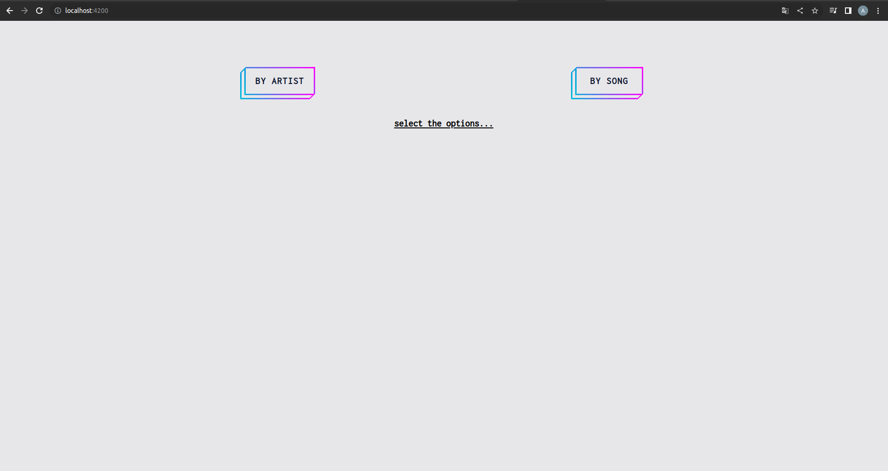
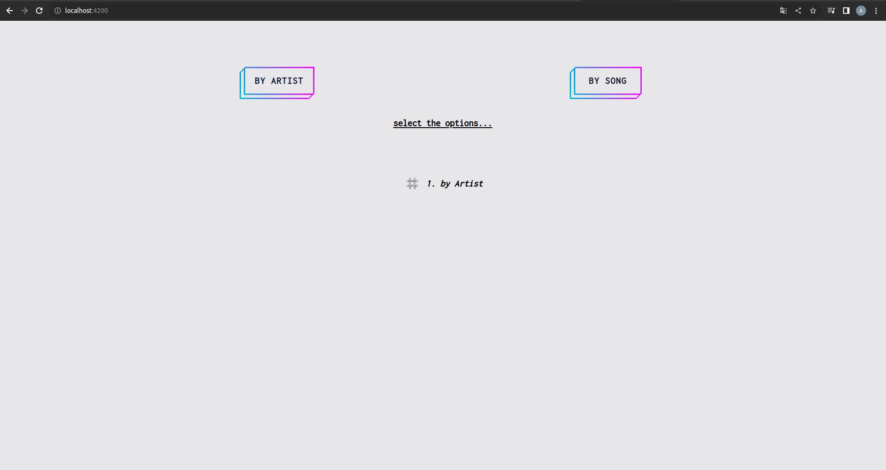
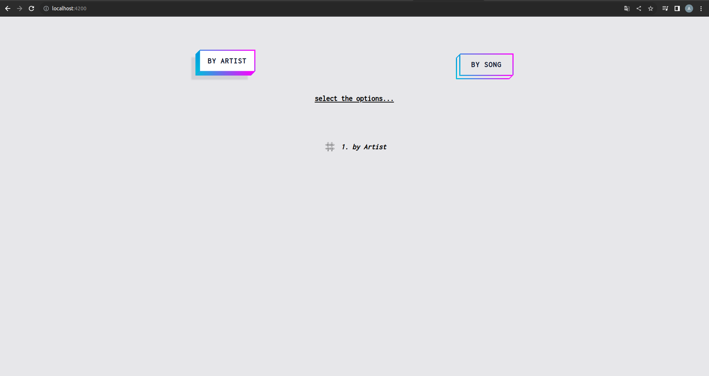
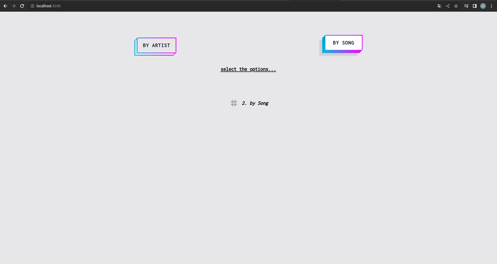

# AnysongPlatform

Have you ever wondered how you can find a song by lyrics alone? Is this even possible?

Using a tool to search for a song can save time and effort by quickly providing accurate results.
To use a lyric finder for songs, you would simply enter the name of the song or the artist
into the search bar and browse through the results to find the lyrics you are looking for.

### Feature requests:

It can also help in discovering new songs and artists, organizing music collections, and accessing lyrics
and other information about the song. Also offer the ability to search by specific lyrics or phrases within a song.

### Current status:

  
  
  
  

🔎 **Smart, Fast and Extensible Build System**
